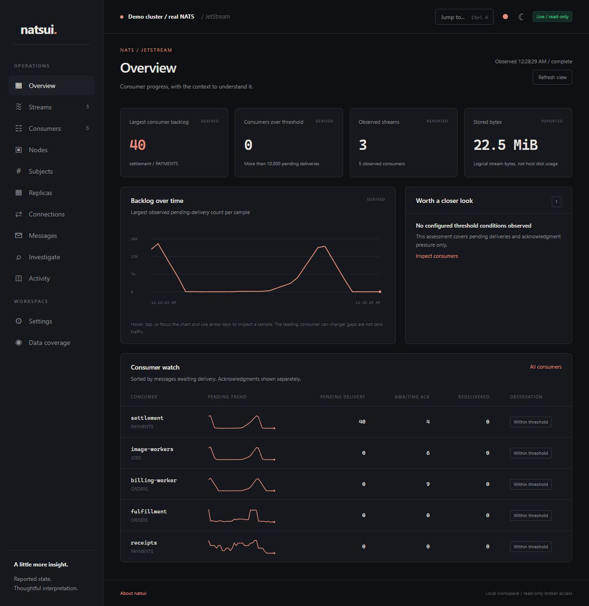
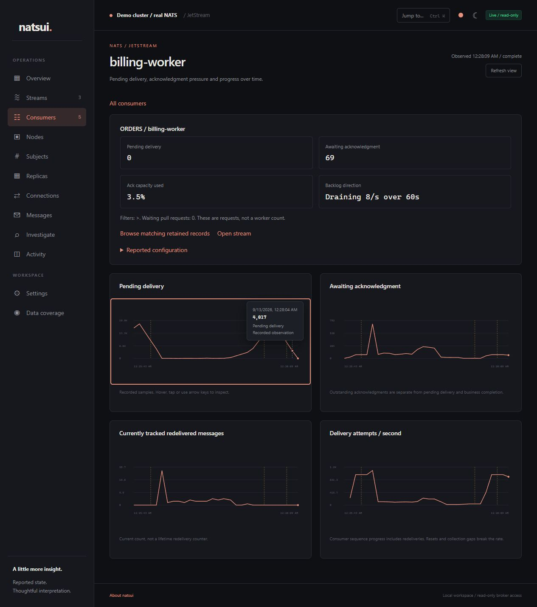
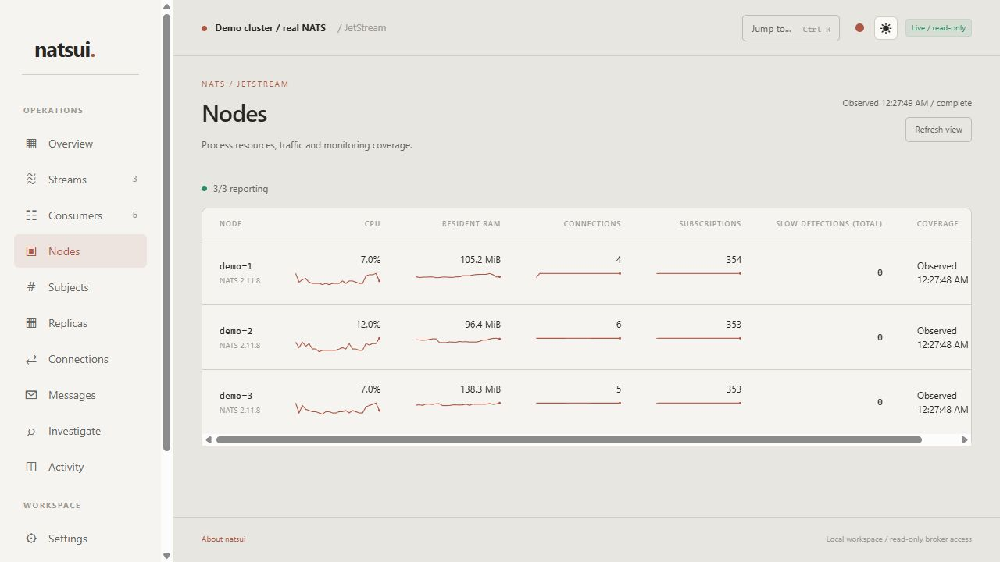

# Natsui

**See what is happening in NATS and JetStream.**

A local, read-only dashboard for consumer backlogs, stream storage, node resources and incident investigation. Inspect a point on a graph, follow it to a consumer, and check what is actually retained in the stream.

[](https://github.com/Axmouth/natsui/actions/workflows/verify.yml)
[](LICENSE)



*Real NATS data, generated demo traffic. Screenshots use the included three-node cluster.*

## What it helps answer

- **Which consumer is falling behind?** Compare pending deliveries, acknowledgment pressure and delivery-attempt trends. Backlog uses the least caught-up observed consumer, without adding overlapping consumers together.
- **What changed around that time?** Follow recorded changes and JetStream advisories into a shared investigation window. Inspect timestamps, pause the view and export the evidence.
- **Is the message still there?** Browse retained records, filter by subject or look up an exact sequence. Inspection never pulls from or acknowledges an application consumer.
- **Where is the pressure?** See per-node CPU, resident RAM, connections, subscriptions and traffic, alongside stream storage trends and replica placement.
- **What matches this subject?** Explore stream capture, consumer filters and observed subscription interest. A filter match indicates eligibility, not proof of delivery.

Reported values, derived metrics and unavailable evidence stay distinct. Gaps remain gaps. CPU and RAM describe NATS processes, not container capacity.

<details>
<summary><strong>Consumer diagnostics and inspectable history</strong></summary>



</details>

<details>
<summary><strong>Node trends and light themes</strong></summary>



</details>

## Try a real cluster

Docker is enough. From a source checkout:

```sh
git clone https://github.com/Axmouth/natsui.git
cd natsui
docker compose -f demo/compose.yaml -f demo/dashboard.yaml up --build -d --wait
```

Open **[localhost:4321](http://localhost:4321)**. The setup includes three unmodified NATS servers, the dashboard and a traffic generator. Streams, consumers and Core NATS traffic move through steady, slow-consumer, burst and recovery phases. The scenario is scripted; the records and metrics come from real broker activity.

Stop the demo while preserving its data:

```sh
docker compose -f demo/compose.yaml -f demo/dashboard.yaml down
```

Port 4321 must be available. `NATSUI_DEMO_PORT` selects another dashboard port. [Demo setup and lifecycle](demo/README.md) covers ports, volumes and the optional Windows launcher.

## Connect an existing NATS server

Build the embedded native binary with Rust 1.94 or later and a C toolchain:

```sh
cargo build --release --locked
NATSUI_URL=nats://127.0.0.1:4222 NATSUI_PROFILE=local ./target/release/natsui
```

<details>
<summary>PowerShell</summary>

```powershell
cargo build --release --locked
$env:NATSUI_URL = 'nats://127.0.0.1:4222'
$env:NATSUI_PROFILE = 'local'
.\target\release\natsui.exe
```

</details>

The binary serves its own UI and stores history in SQLite. No Node runtime, separate database service, broker plugin or Docker socket is required. The root `compose.yaml` also packages the dashboard for an existing broker.

Use a dedicated restricted NATS identity. [Security and permissions](SECURITY.md) includes the permission template, credentials-file setup, private CA and mutual TLS options. Optional `NATSUI_MONITOR_URLS` enables native process and connection monitoring.

[Full configuration, storage limits and troubleshooting context](docs/OPERATIONS.md)

## A demo without a backend

`natsui --demo` runs a clearly labeled local simulation. For a browser-only version:

```sh
node scripts/export-demo.mjs
```

Serve `dist-demo` with a static web server. It models workload phases, consumer histories and incidents without connecting to NATS. Native node metrics remain explicitly unavailable in this mode. No hosted public demo is published yet.

## Status

**Local read-only beta.** Stream and consumer inspection, node monitoring, retained-record browsing and investigation history are implemented. Shared login, public HTTP deployment, broker mutations and server configuration control are outside the current access model.

The integration suite has passed on Windows and Linux with NATS Server 2.11.8, including TLS, denied operations, reconnects and bounded large inventories. CI also targets macOS; support claims depend on successful runner results. The first endurance recording was interrupted and is not a completed 24-hour qualification. [Release evidence and remaining gates](RELEASE_CHECKLIST.md)

## Development and ideas

```sh
cargo test --locked
node scripts/test-trends.mjs
node scripts/test-demo.mjs
```

Full disposable-broker tests and Docker verification are described in [operations](docs/OPERATIONS.md#verification). [Issues](https://github.com/Axmouth/natsui/issues) are a place for reproducible bugs, confusing evidence and operational questions the dashboard should help answer. Reports should omit credentials and private message payloads.

The [porting ledger](PORTING_LEDGER.md) records which Fibril ideas were adapted, changed or left out, and which NATS-specific capabilities were added.

## Acknowledgments

Inspired by [Fibril](https://github.com/Axmouth/fibril), with its theme collection and incident-oriented interface as the starting point. Original MIT attribution is preserved in [LICENSE](LICENSE). Natsui uses its own pixel kitten favicon and is an independent project, not an official NATS project.
